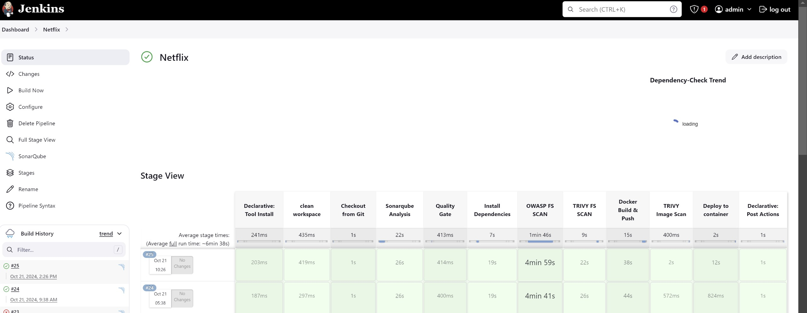

# Netflix Clone DevSecOps Project

In this project, I worked on a **Netflix streaming clone** using various **DevSecOps practices**. The goal was to **build**, **secure**, and **monitor** the application while setting up a **continuous integration and continuous delivery (CI/CD) pipeline** using **Jenkins**. I focused heavily on **automation** and integrating **security checks** throughout the process.

---

## 🚀 Tech Stack and Tools Used:

- **Jenkins**: CI/CD automation
- **Docker**: Containerization of the application
- **Kubernetes**: Orchestration and deployment
- **Amazon EKS**: Managed Kubernetes service for deployment
- **SonarQube**: Static code analysis for security checks
- **Trivy**: Security vulnerability scanning
- **Prometheus & Grafana**: Monitoring and alerting
- **ArgoCD**: GitOps for continuous delivery
- **Helm**: Kubernetes package manager

These tools enabled me to build a **fully automated pipeline** that ensures security is built into every step, from **development to deployment**.

*The complete workflow and all the stacks tools involved.*

---

### Phase 1: Initial Setup and Deployment
First, I provisioned an EC2 instance on AWS running Ubuntu 22.04. Once connected via SSH, I cloned the application code from my GitHub repository. After that, I installed Docker and used it to containerize the Netflix app.

*The image is automatically pushed to DockerHub after building the application.*

---

### Phase 2: Security with SonarQube and Trivy
Security was a crucial aspect of the project, so I set up **SonarQube** and **Trivy** to scan the code and Docker images for vulnerabilities. SonarQube was integrated into my Jenkins pipeline to check code quality and security issues.

*SonarQube confirms that the code passed all quality gates.*

---

### Phase 3: CI/CD with Jenkins
Jenkins played a central role in automating the deployment process. I set up a Jenkins pipeline that included multiple stages, including code checkout, quality gate validation, and vulnerability scanning.

*Jenkins CI/CD pipeline automatically triggers deployments.*

---

### Phase 4: Monitoring with Prometheus and Grafana
To keep the app monitored, I installed **Prometheus** and **Grafana**. Prometheus scrapes metrics from my Kubernetes nodes and monitors the system’s health. Grafana visualizes these metrics for easy monitoring.

*Prometheus is scraping metrics from Kubernetes.*

*Grafana visualizes CPU and memory usage metrics from Kubernetes nodes.*

---

### Phase 5: Kubernetes Deployment with ArgoCD
I deployed the app using **Kubernetes on AWS EKS** (Elastic Kubernetes Service). I also integrated **ArgoCD** for continuous delivery, which synced my GitHub repository with the Kubernetes cluster.

*AWS EKS cluster running the Netflix app.*

*ArgoCD synchronizing changes from GitHub to the Kubernetes cluster.*

---

### Phase 6: Netflix App Interface
Once the deployment was complete, the Netflix streaming clone was fully functional and accessible.

*Netflix clone app user interface, streaming "Beetlejuice".*

---

### Conclusion
This project gave me hands-on experience with a wide variety of DevSecOps tools and technologies such as Jenkins, SonarQube, Trivy, Prometheus, Grafana, Docker, Kubernetes, and ArgoCD. The emphasis was not just on getting the Netflix clone app up and running but ensuring it was secure and properly monitored.

--- 

## 📽️ Project Demo Video

Check out the full video walkthrough of this project on YouTube:  

---

### 📝 Additional Links
- [GitHub Repository](https://github.com/olukayodedevs/Streaming-App-DevSecOp/)
- [Connect with me on LinkedIn](https://www.linkedin.com/in/arindeolukayode/)

---

*The image is automatically pushed to DockerHub after building the application.*